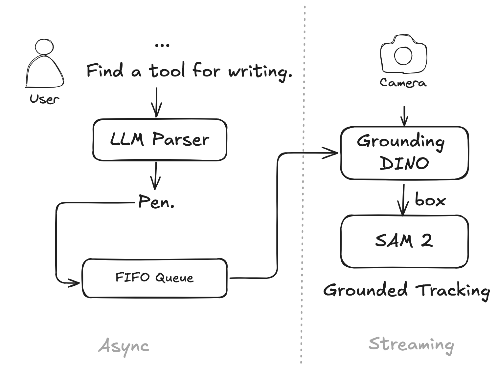

# Streaming Grounded SAM 2

Grounded SAM 2 for streaming video tracking using natural language queries.


## Demo


## Framework

<div align=center>

<p align="center">

</p>

</div>


This system is comprised of three components:

- **LLM**: This module is responsible for parsing the input query or inferring the intended object.
- **GroundingDINO**: This component handles object referencing.
- **SAM-2**: This part specializes in object tracking.

## Getting Started

### Installation


1. Prepare environments

```bash
conda create -n sam2 python=3.10 -y
conda activate sam2
pip install -e .
```

2. Download SAM 2 checkpoints

```bash
cd checkpoints
./download_ckpts.sh
```
3. Download Grounding DINO checkpoints

```bash
cd gdino_checkpoints
./download_ckpts.sh
```
or huggingface version (recommend)

```bash
cd gdino_checkpoints
huggingface-cli download IDEA-Research/grounding-dino-tiny --local-dir grounding-dino-tiny
```

4. Download LLM

4.1 GPT4-o (recommend)

```bash
cd llm
touch .env
```

past your API_KEY or API_BASE (Azure only)

```
API_KEY="xxx"
API_BASE = "xxx"
```

4.2 Qwen2

```bash
cd llm_checkpoints
huggingface-cli download Qwen/Qwen2-7B-Instruct-AWQ --local-dir Qwen2-7B-Instruct-AWQ
```
install the corresponding packages


### run demo

Step-1: Check available camera
```bash
python cam_detect.py
```

If a camera is detected, modify it in `demo.py`.

Step-2: run demo

currently available model: `Qwen2-7B-Instruct-AWQ`, `gpt-4o-2024-05-13`

```bash
python demo.py --model gpt-4o-2024-05-13
```

## Acknowledge:

- [segment-anything-2](https://github.com/facebookresearch/segment-anything-2)
- [Grounded-SAM-2](https://github.com/IDEA-Research/Grounded-SAM-2)
- [segment-anything-2-real-time](https://github.com/Gy920/segment-anything-2-real-time)
